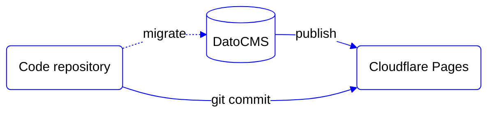

# Head Start

**Base setup on top of headless services to help you quickly start a new website**

## Philosophy

- Provide a generic template to help develop new websites (not web apps) faster.
- Provide a pre-defined setup for composable pages with common components.
- Provide pre-configured services like a CMS and deployment platform.
- Support common needs like internationalisation (i18n), SEO, redirects and analytics.
- Provide functional interactivity without a JS framework (React, Vue, Svelte, etc)*.
- Provide functional interactivity without specific styling ("unstyled")*.
- Provide a fully accessible and highly performant baseline for every project.
- Utilise testing to ensure quality and prevent regressions.

\* We'll leave the choice for a JS framework and strategy for styling to developers using Head Start for their project.

## Roadmap

Current status: Head Start is suitable for internal use by De Voorhoede.

- [v1](https://github.com/voorhoede/head-start/issues?q=is%3Aissue+is%3Aopen+label%3A%22v1%22+): all common website functionality for use by De Voorhoede.
- [v1 public](https://github.com/voorhoede/head-start/issues?q=is%3Aissue+is%3Aopen+label%3A%22v1+public%22+): extend setup and documentation to be suitable for use outside De Voorhoede.
- [v2](https://github.com/voorhoede/head-start/issues/77): ideas for Head Start as starterkit for websites & web apps (maybe, someday).

Progress can also be tracked on the [Head Start project board](https://github.com/orgs/voorhoede/projects/5).

## Architecture

The site is created as lightweight progressively enhanced website connected to a headless CMS:

- [Astro](https://astro.build/) - web framework to structure this project. Astro is selected because it embraces web standards, is designed for performance, and supports all our favourite UI frameworks (React, Vue and Svelte).
- [DatoCMS](https://www.datocms.com/) - a headless CMS is connected to manage web content. DatoCMS is selected for its modular and structured content options, advanced image service, multi-language support and GraphQL API.
- [Cloudflare Pages](https://pages.cloudflare.com/) - is a JAMstack hosting platform. Cloudflare Pages is selected for its reliable CDN, zero cold-start workers, green hosting and affordable pricing.

## Getting started

Follow the step-by-step [getting started instructions](docs/getting-started.md).

## Documentation

All documentation is located in [`docs/`](docs/):

- [Getting Started](docs/getting-started.md)
- [Accessibility (a11y)](docs/accessibility.md)
- [Blocks and Components](docs/blocks-and-components.md)
- [CMS Content Modelling](docs/cms-content-modelling.md)
- [CMS Data Loading](docs/cms-data-loading.md)
- [Internationalization (i18n)](docs/i18n.md)
- [Project Structure](docs/project-structure.md)
- [Preview Mode](docs/preview-mode.md)
- [Routing](docs/routing.md)
- [Search](docs/search.md)
- [Search Engine Optimisation (SEO)](docs/seo.md)
- [Testing](docs/testing.md)
- [Upgrading](docs/upgrading.md)

## Commands

All commands are run from the root of the project, from a terminal:

| Command (`npm run ...`) | Action
|:------------------------| :-----------------------------------------------
| `dev`                   | Starts local dev server at `localhost:4323` (head in T9)
| `build`                 | Build your production site to `./dist/`
| `preview`               | Preview your build locally, before deploying
| `astro ...`             | Run commands like `astro add` (see `astro -- --help`)
| `create`                | Scaffold new Block, Component, API or Page route
| `lint`                  | Check code style and valide HTML output
| `test`                  | Runs the test suite, individual tests are available using `test:...`

## Contributing

Head Start welcomes contributions of any size and skill level. See [our contribution guidelines](./.github/CONTRIBUTING.md).

## License

Head Start is made with ❤️ by [De Voorhoede](https://www.voorhoede.nl/en/).
Released under [ISC License](./LICENSE.md).
