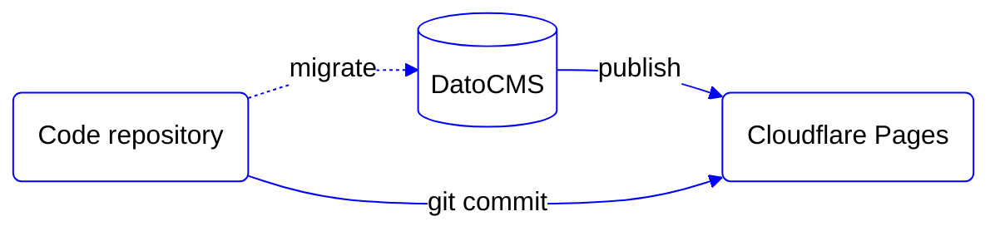

# Head Start

**Base setup on top of headless services to help you quickly start a new website**

## Philosophy

- Provide a generic template to help develop new websites (not web apps) faster.
- Provide a pre-defined setup for composable pages with common components.
- Provide pre-configured services like a CMS and deployment platform.
- Support common needs like internationalisation (i18n), SEO, redirects and analytics.
- Provide functional interactivity without a JS framework (React, Vue, Svelte, etc)*.
- Provide functional interactivity without specific styling ("unstyled")*. 
- Provide a fully accessible and highly performant baseline for every project.

\* We'll leave the choice for a JS framework and strategy for styling to developers using Head Start for their project.

## Architecture

The site is created as lightweight progressively enhanced website connected to a headless CMS:

- [Astro](https://astro.build/) - web framework to structure this project. Astro is selected because it embraces web standards, is designed for performance, and supports all our favourite UI frameworks (React, Vue and Svelte). 
- [DatoCMS](https://www.datocms.com/) - a headless CMS is connected to manage web content. DatoCMS is selected for its modular and structured content options, advanced image service, multi-language support and GraphQL API.
- [Cloudflare Pages](https://pages.cloudflare.com/) - is a JAMstack hosting platform. Cloudflare Pages is selected for its reliable CDN, zero cold-start workers, green hosting and affordable pricing.

## Getting started

1. Select "Use this template" > "Create a new repository".
2. Clone the new repository.
3. [Create a DatoCMS instance](https://dashboard.datocms.com/personal-account/projects/browse/new).
4. Copy `.env.example` to `.env` and fill it out.
5. Install the dependenies (`npm install`)
6. You're good to go. Follow any of the [commands](#commands) below.

## Documentation

All documentation is located in [`docs/`](docs/):

- [Internationalization (i18n)](docs/i18n.md)
- [Project Structure](docs/project-structure.md)

## Commands

All commands are run from the root of the project, from a terminal:

| Command (`npm run ...`) | Action                                          
|:------------------------| :-----------------------------------------------
| `dev`                   | Starts local dev server at `localhost:4323` (head in T9)
| `build`                 | Build your production site to `./dist/`
| `preview`               | Preview your build locally, before deploying
| `astro ...`             | Run CLI commands like `astro add`, `astro check`
| `astro -- --help`       | Get help using the Astro CLI
| `lint`                  | Check code style (add `-- --fix` to fix issues)

## Contributing

Head Start welcomes contributions of any size and skill level. See [our contribution guidelines](./.github/CONTRIBUTING.md).
