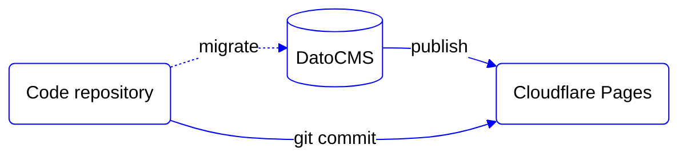

# Head Start

**Base setup on top of headless services to help you quickly start a new website**

## Philosophy

- Provide a generic template to help develop new websites (not web apps) faster.
- Provide a pre-defined setup for composable pages with common components.
- Provide pre-configured services like a CMS and deployment platform.
- Support common needs like internationalisation (i18n), SEO, redirects and analytics.
- Provide functional interactivity without specific styling ("unstyled").
- Provide a fully accessible and highly performant baseline for every project.

## Architecture

The site is created as lightweight progressively enhanced website connected to a headless CMS:

- [Astro](https://astro.build/) - web framework to structure this project. Astro is selected because it embraces web standards, is designed for performance, and supports all our favourite UI frameworks (React, Vue and Svelte). 
- [DatoCMS](https://www.datocms.com/) - a headless CMS is connected to manage web content. DatoCMS is selected for its modular and structured content options, advanced image service, multi-language support and GraphQL API.
- [Rosetta](https://github.com/lukeed/rosetta) - is an internationalization (i18n) library. Rosetta is selected for its small footprint (<300 bytes) and for being framework agnostic.
- [Cloudflare Pages](https://pages.cloudflare.com/) - is a JAMstack hosting platform. Cloudflare Pages is selected for its reliable CDN, zero cold-start workers, green hosting and affordable pricing.



## 🚀 Project Structure

Inside of this project, you'll see the following folders and files:

```
/
├── config/
├── docs/
│   └── decision-log/
├── public/
│   └── favicon.svg
├── src/
│   ├── blocks/
│   │   ├── Blocks.astro
│   │   └── SomeContentBlock/
│   │       ├── SomeContentBlock.astro
│   │       └── SomeContentBlock.fragment.graphql
│   ├── components/
│   │   └── SomeUiComponent.astro
│   ├── icons/
│   │   └── name.svg
│   ├── layouts/
│   │   └── Default.astro
│   └── pages/[locale]/
│       ├── index.astro
│       └── index.query.graphql
└── package.json
```

- `docs/` contains project documentation.
  - `decision-log/` lists all key decisions made during the project. Please read the log so you understand why decisions are made and document key decisions when you make them.
- `src/` contains all website source files that will be handled by Astro.
  - `pages/` - [Pages](https://docs.astro.build/en/core-concepts/astro-pages/) are organised by file system routing and are paired with GraphQL query files for data loading.
  - `components/` - [Components](https://docs.astro.build/en/core-concepts/astro-components/) are the elements the website is composed of. This can be Astro and framework specific components.
  - `blocks/` - Blocks are a specific set of components which have a complementary content [Block](https://www.datocms.com/docs/content-modelling/blocks) in DatoCMS and therefore have a paired GraphQL fragment file.
  - `layouts/` - [Layouts](https://docs.astro.build/en/core-concepts/layouts/) are Astro components used to provide a reusable UI structure, such as a page template.
  - `icons/` - SVG icons, can be used with `<Icon name={ basename }>` (See [`src/components/Icon/`](src/components/Icon/)).
- `public/` is for any static assets, like fonts and favicons, that should be available on the website as-is.
- `config/` bundles all our configuration files (like DatoCMS migrations), so the project root doesn't become too cluttered.
- `scripts/` contains all our custom CLI scripts, typically available via `package.json` > `scripts`. Also see [Commands](#-commands).

## Getting started

1. Select "Use this template" > "Create a new repository".
2. Clone the new repository.
3. [Create a DatoCMS instance](https://dashboard.datocms.com/personal-account/projects/browse/new).
4. Copy `.env.example` to `.env` and fill it out.
5. Install the dependenies (`npm install`)
6. You're good to go. Follow any of the [commands](#commands) below.

## 🧞 Commands

All commands are run from the root of the project, from a terminal:

| Command (`npm run ...`) | Action                                          
|:------------------------| :-----------------------------------------------
| `dev`                   | Starts local dev server at `localhost:4323` (head in T9)
| `build`                 | Build your production site to `./dist/`
| `preview`               | Preview your build locally, before deploying
| `astro ...`             | Run CLI commands like `astro add`, `astro check`
| `astro -- --help`       | Get help using the Astro CLI
| `lint`                  | Check code style (add `-- --fix` to fix issues)
